# Adobe-GenSolve : Curvetopia 
### Curvetopia: A Curve Processing and Regularization Program
This project provides a set of tools for processing and regularizing curves from CSV data. The code includes functionalities for reading and visualizing paths, identifying regular shapes, exploring symmetry, and completing incomplete curves.

## Features
- **Read CSV Files**: The code reads and processes CSV files containing path data.
- **Plot Paths**: Visualize paths to better understand the shapes and curves.
- **Shape Identification**: Identify regular shapes such as lines, circles, ellipses, rectangles, polygons, and star shapes.
- **Symmetry Exploration**: Explore symmetry within the identified shapes.
- **Curve Completion**: Complete fragmented or incomplete curves.
- **DBSCAN Clustering**: Group closely connected points to manage fragmented shapes.
- **CSV Output**: Export processed paths back into a CSV format.

## Installation
### Prerequisites:
Ensure you have the following Python libraries installed:
```python
pip install numpy matplotlib scikit-learn scipy
```

## Usage
### Processing Curves:
The main function to process curves is `process_curves`. It takes two arguments: the input `CSV` file and the output `CSV` file.
```python
process_curves('path/to/input.csv', 'path/to/output.csv')
```

### Example
```python
process_curves('problems/problems/isolated.csv', 'problems/problems/isolated_sol.csv')
```

## Visualizing Curves
To visualize the paths, the `plot_paths` function is used:
```python
paths_XYs = read_csv('path/to/input.csv')
plot_paths(paths_XYs, title='Input Curves')
```

## Structure of the CSV File
The input CSV files should be structured with paths identified by a unique ID in the first column, followed by the X and Y coordinates:
```python
path_id, x, y
1, 10.0, 15.0
1, 12.0, 18.0
...
```

## Future Enhancements
- **Shape Identification**: Implement logic to identify and regularize shapes like lines, circles, ellipses, etc.
- **Symmetry Exploration**: Add functionality to detect and analyze symmetry in the paths.
- **Curve Completion**: Develop methods to automatically complete curves that are fragmented or incomplete.

## Snapshots 
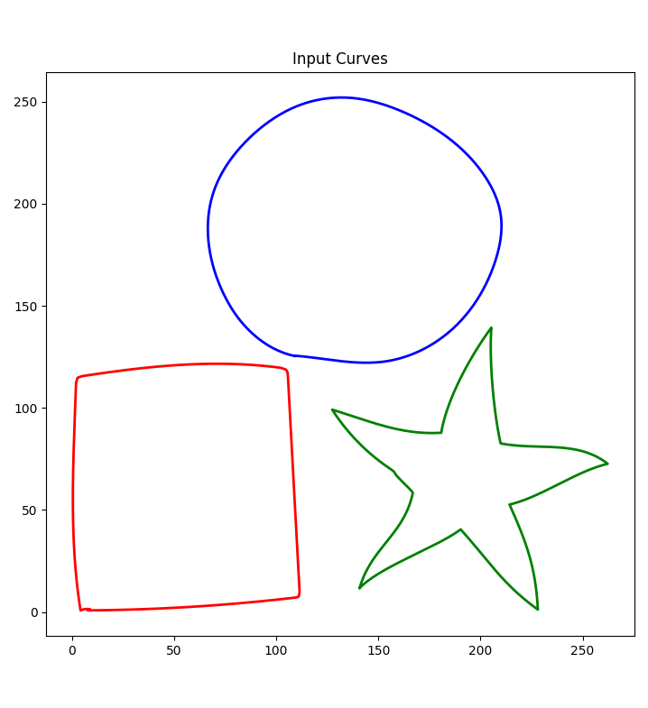


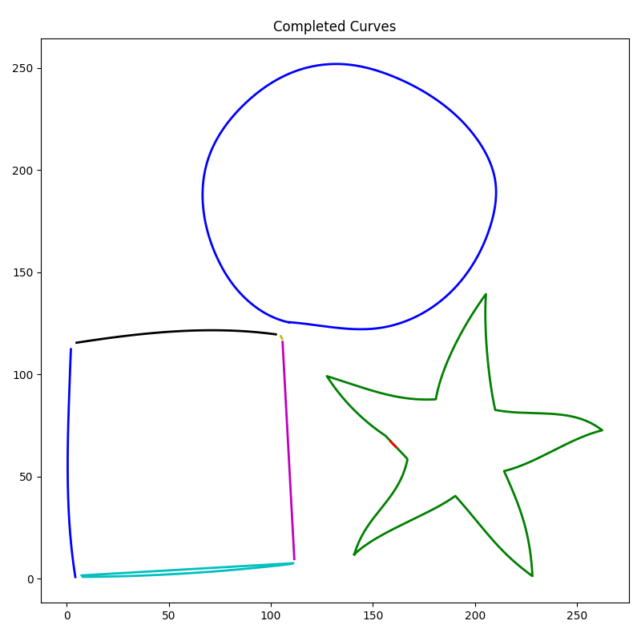
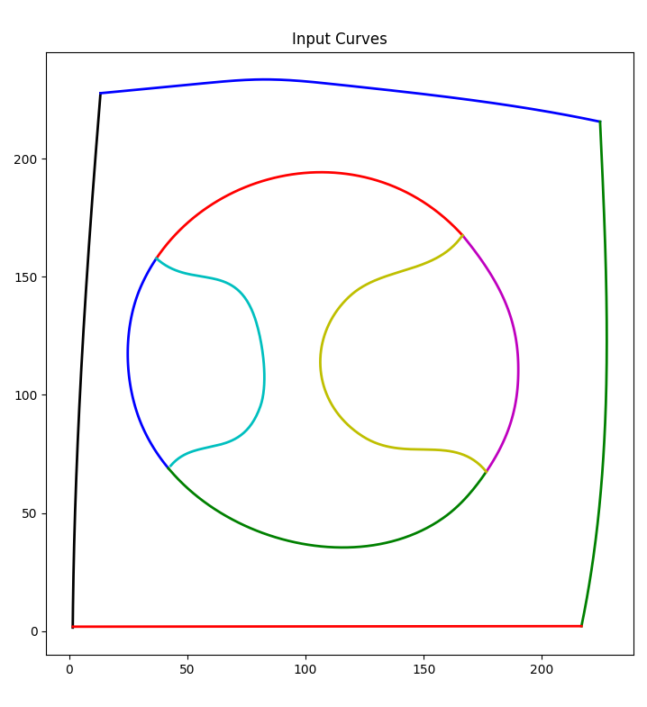
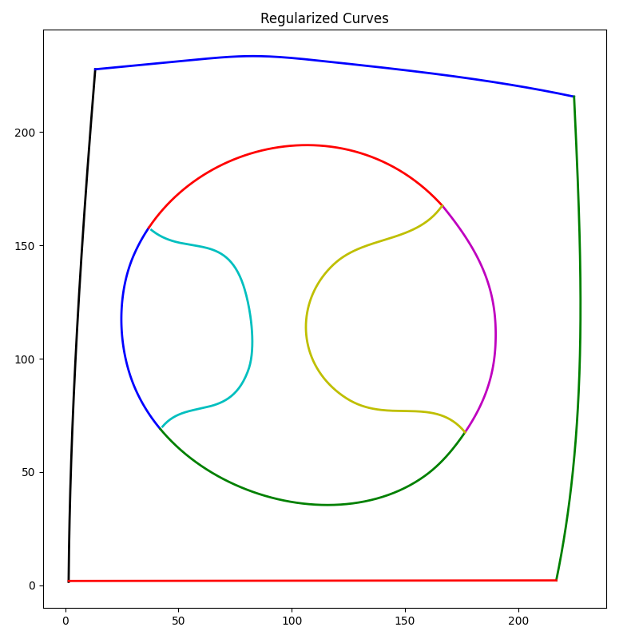
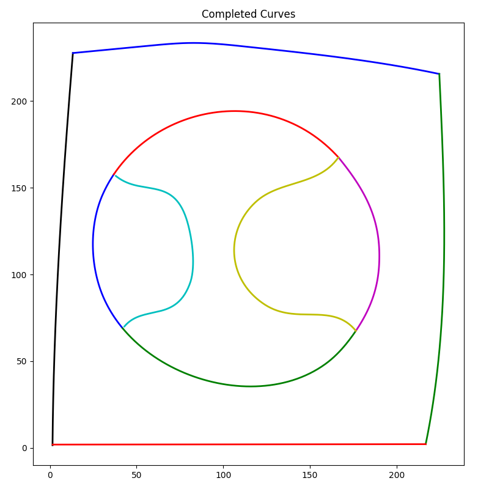
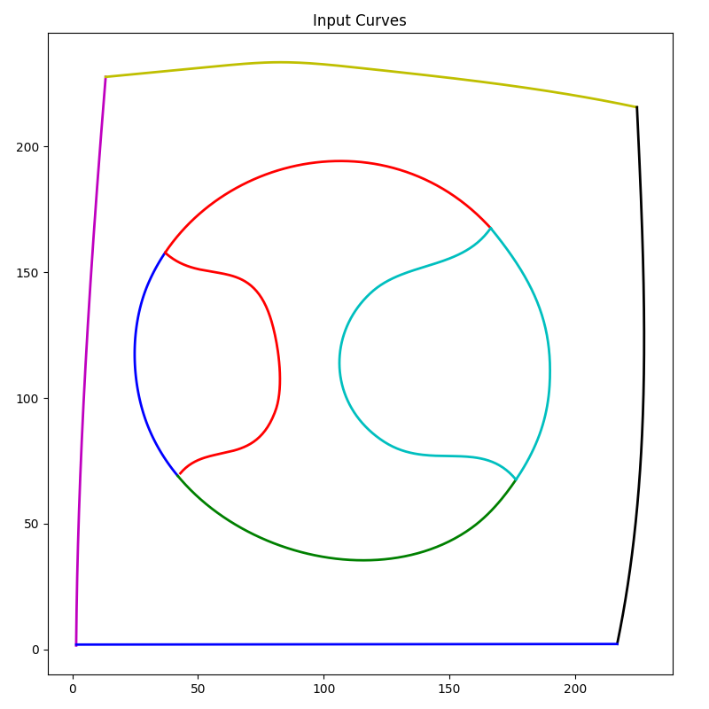

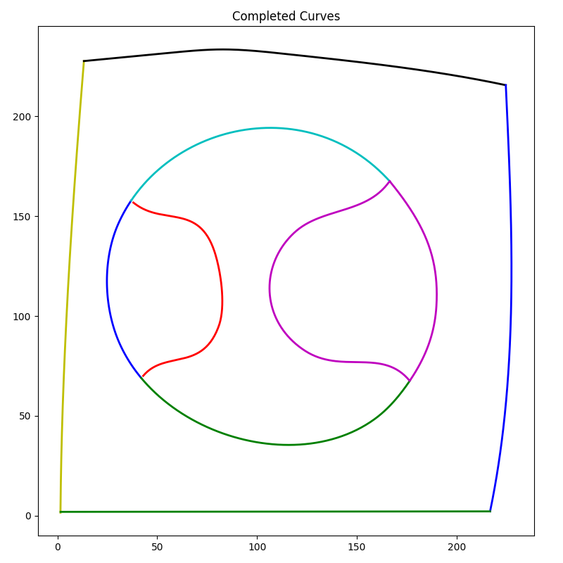
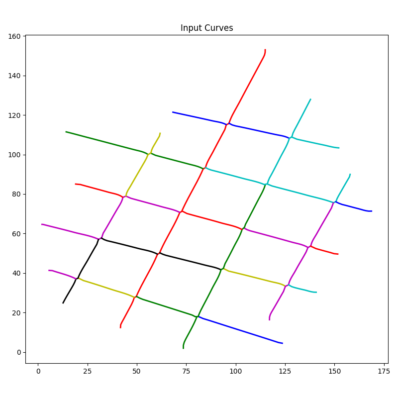
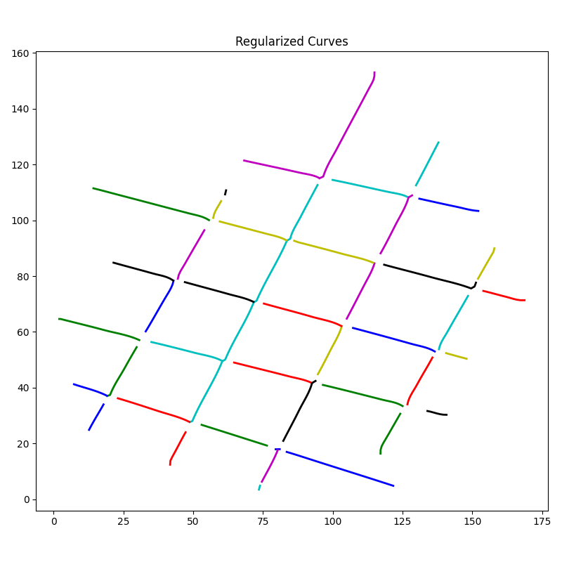


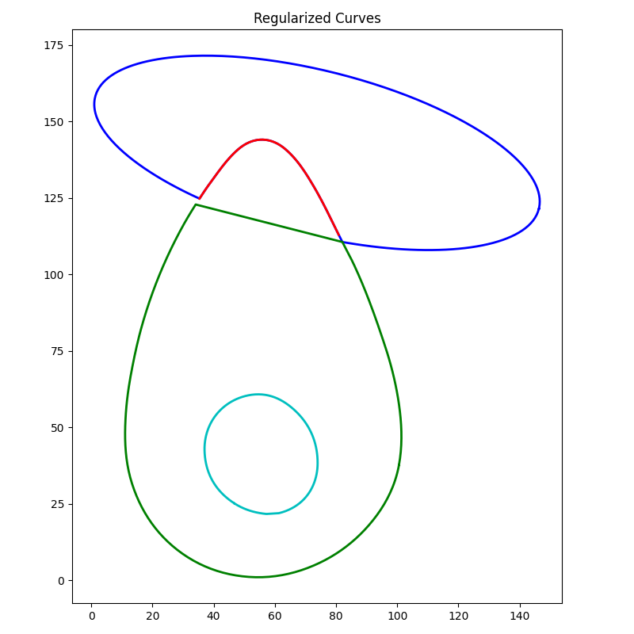

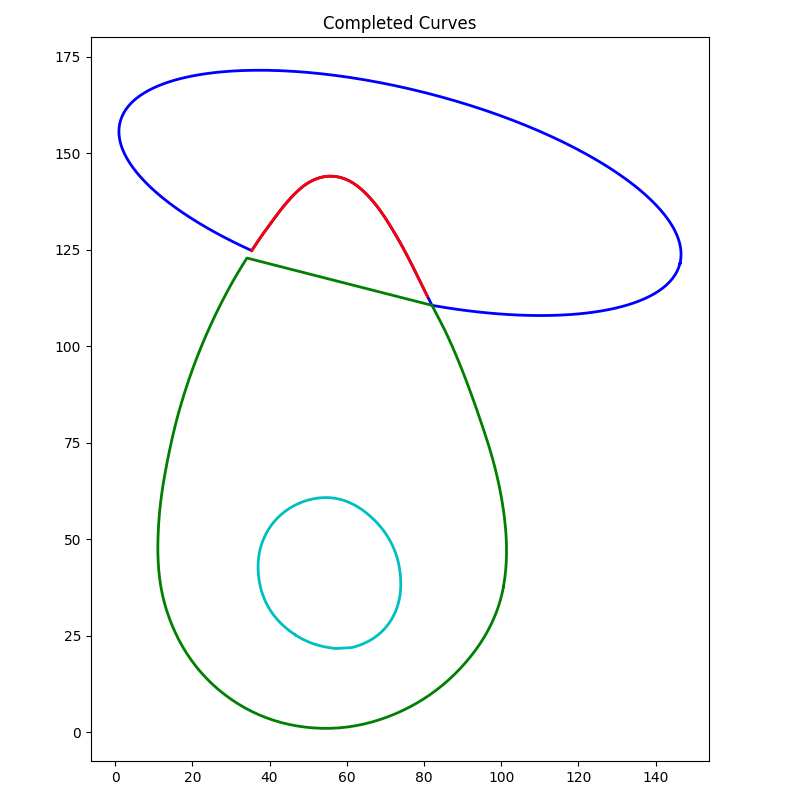
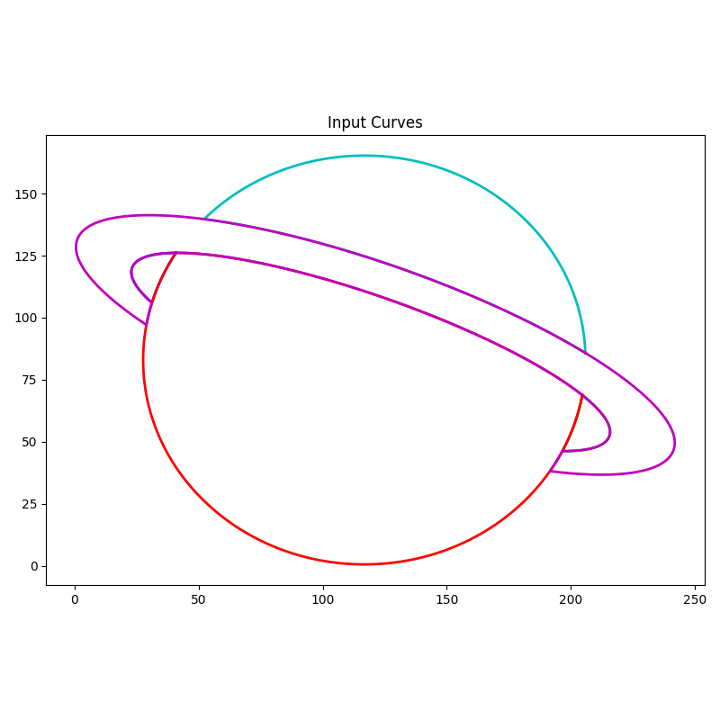
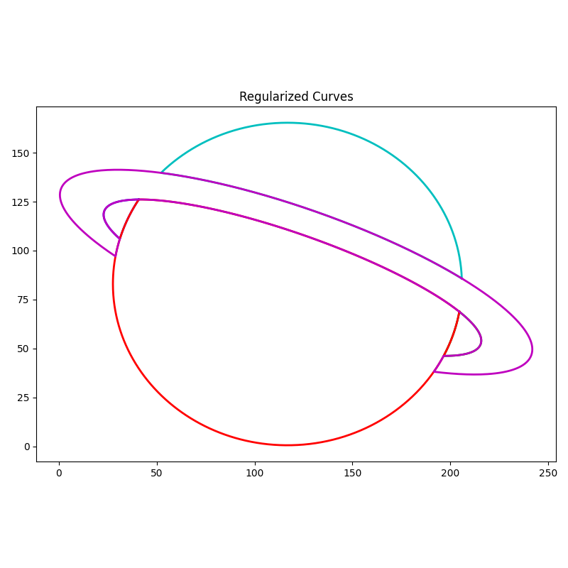
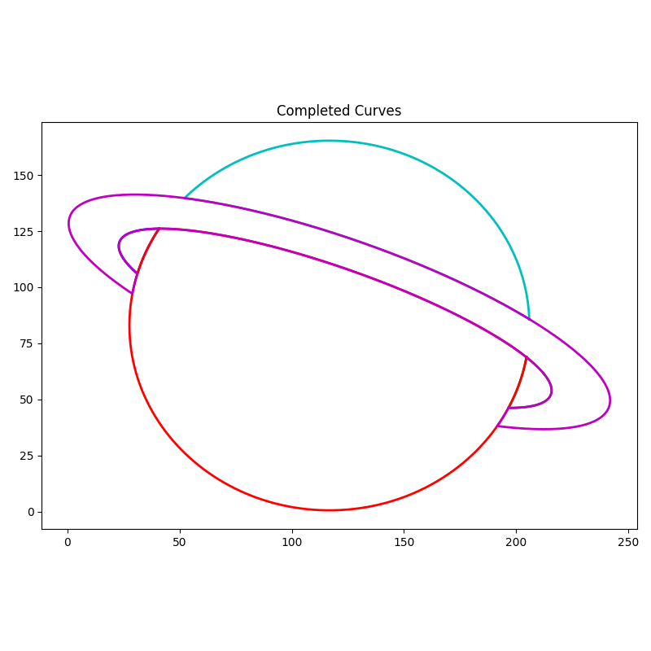